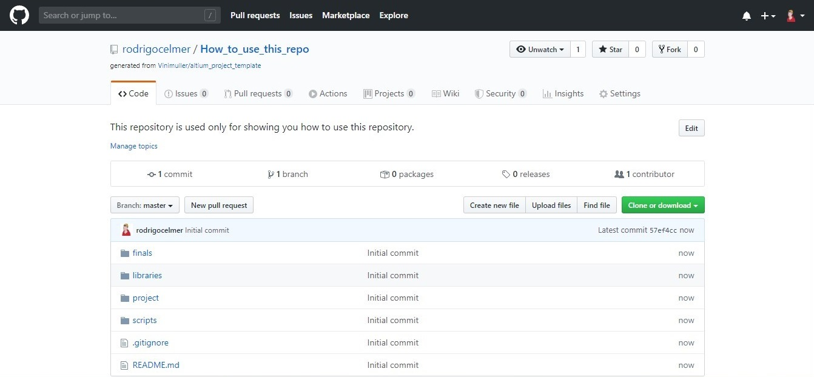

# Altium Project Template

---

This repo suggests a way to organize Altium's files and folders to use them with Git.

## Organization

---

- **project**
    - .SchDoc, .PcbDoc, .PrjDoc, and .OutJob files should be in this folder.
- **finals**
    - Gerber files, BOM, SCH, and PCB PDF's, and any other output generated files should be in this folder.
- **libraries**
    - The libraries that you use on your project should be in this folder. (It is recommended to use libs as submodules).
- **scripts**
    - Scripts should be in this folder.

.gitignore file is set to keep track of .SchDoc, .PcbDoc, .PrjDoc, .OutJob files, finals fodler, libraries and scripts.

## How to use this repo

---

**1)** Click in "Use this template" button, it will redirect you to the page that will create a new repository from altium_project_template

**2)** Give your brand new repository a name accordingly to the project you are working on. It is, also, highly recommended to describe what this repository is about in the "Description" field. Choose if this repository will be a Public ou Private repo (can be changed later) and select "Include all branches" mark box. Then click in "Create repository from template"

**3)** A few seconds later, your repository will be ready to be used

**4)** Now you should clone it into your local repository. To do that, click in "Clone or download" button and then in the button to copy the repo's link

**5)** On GitKraken, click "File" and "Clone Repo" (Ctrl + N is the shortcut)

**6)** On the new window that just popped up, paste the repo's link on the "URL" field and then click in "Clone the repo!"

**7)** When GitKraken is finished cloning your repo, a message will be shown informing you that. Now you should click "Open Now" button

**8)** And your GitKraken should be like this

**9)** Submodule add has to be here

**10)** Now go find the local repository on your desktop (you should know where it is). Mine is at C:\Users\Celmer\Documents\GitHub, for example. Find and open the repository you have just created

**11)** On this folder you can see your repository folders and files. You can explore it later. Open "project" folder

**12)** Here you have .OutJob (outjob), .PcbDoc (pcb), .PrjDoc (project name), and .SchDoc (sch) files. outjob, pcb and sch files **should not be renamed**, but it is highly recommended to rename project name file accordingly to the project you are working on (yes, it can have the same name as the repository)

**13)** After renaming "project name" file, you can open it and start working (it is assumed that you know how to use Altium)

**14)** Add the libraries to the project

**15)** Now you can start working on the project itself

**16)** After your work is done, on Altium, open outjob.OutJob file (it is in Settings, Output Job Files)

**17)** On the outjob.OutJob file, there is a window called "Output Containers" which has all the files that we want to generate from the project. You should go one by one and click on "Generate content". There will be a little bit of loading time on each file

**18)** You can check on the "finals" folder the files that were generated. It is good to use a Gerber viewer to check the Gerber files generated

**19)** If everything is ok, you should zip the GERBER and ODB folders and delete them

Feel free to improve this ;)